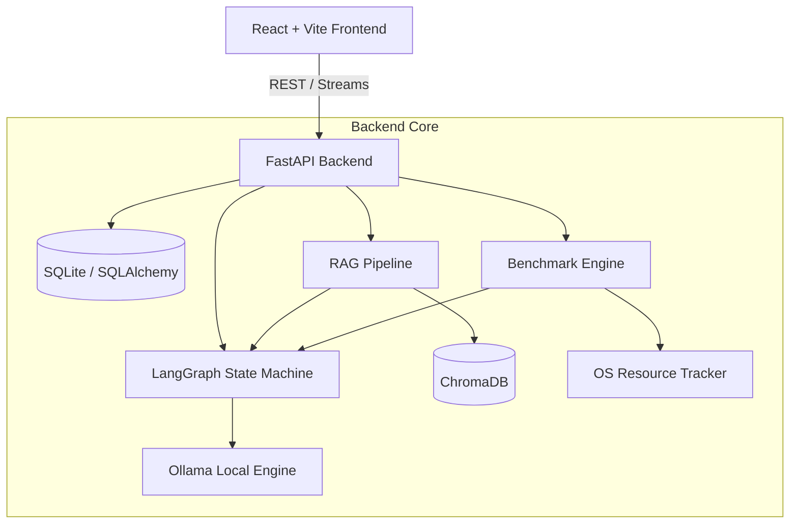

<div align="center">
  
# 🚀 Offline AI Assistant & Benchmark Engine

**A production-grade, privacy-first local LLM assistant with a built-in benchmarking framework for evaluating model performance at the edge.**

[](https://www.python.org/)
[](https://fastapi.tiangolo.com/)
[](https://reactjs.org/)
[](https://www.docker.com/)
[](https://opensource.org/licenses/MIT)

</div>

---

## 🎯 Problem Statement
As enterprise adoption of Generative AI accelerates, data privacy and edge deployment have become critical bottlenecks. Relying on cloud APIs (like OpenAI or Anthropic) introduces latency, data governance risks, and vendor lock-in. This project demonstrates how to build a **100% offline, self-hosted AI architecture** using open-weights models, complete with an engineering framework to empirically measure and benchmark hardware constraints (RAM, CPU, Latency) before deploying to production.

## ✨ Key Features

*   **🔒 Zero Cloud Reliance (Air-gapped Ready):** All inference runs locally via Ollama. No telemetry, no API keys, no external network requests.
*   **🧠 LangGraph State Machines:** Replaces fragile linear prompt chains with a resilient, cyclic graph. If a model hallucinates invalid JSON, the state machine intercepts the parsing error and prompts the LLM to self-correct.
*   **📚 Local RAG Pipeline:** Ingests PDFs and Markdown files using `PyMuPDF`, chunks data with `RecursiveCharacterTextSplitter`, and performs semantic search via local HuggingFace embeddings (`all-MiniLM-L6-v2`) and ChromaDB.
*   **📊 Empirical Benchmarking Engine:** A custom evaluation engine leveraging `psutil` to quantify model latency, memory footprint (RSS), CPU usage, and strict JSON adherence across 50 diverse reasoning and factual prompts.
*   **💻 Modern Conversational UI:** A React/Vite frontend featuring real-time stream decoding, auto-scrolling, conversation history, and a Chart.js dashboard for visualizing benchmark telemetry.

## 🏗️ System Architecture

The system is decoupled into a React frontend and a FastAPI backend, communicating via REST and HTTP Streams.



## 📸 Screenshots & Demo

> **Note:** Replace these placeholders with actual screenshots of your running application.

<details>
<summary>Click to view screenshots</summary>

*   **Chat UI:** `[Placeholder: Add screenshot of the chat interface streaming a response]`
*   **Document Upload (RAG):** `[Placeholder: Add screenshot showing the PDF upload workflow]`
*   **Benchmark Dashboard:** `[Placeholder: Add screenshot of the Chart.js dashboard]`
*   **Model Comparison:** `[Placeholder: Add screenshot showing Qwen vs Llama vs Gemma]`
*   **Demo GIF:** `[Placeholder: Add a 10-second GIF demonstrating the streaming UI and chart rendering]`

</details>

## 🛠️ Tech Stack

**Backend**
*   **Framework:** FastAPI, Uvicorn
*   **AI/Orchestration:** LangChain, LangGraph, Ollama
*   **Validation:** Pydantic v2

**Database & Retrieval**
*   **Relational DB:** SQLite + SQLAlchemy 2.0 (asyncio)
*   **Vector Store:** ChromaDB
*   **Document Processing:** PyMuPDF, sentence-transformers

**Frontend**
*   **Framework:** React 18, Vite, TypeScript
*   **Styling:** Tailwind CSS, Lucide React
*   **Visualizations:** Chart.js, react-chartjs-2

**DevOps & CI/CD**
*   **Containerization:** Docker, Docker Compose
*   **CI Pipeline:** GitHub Actions
*   **Code Quality:** Ruff, Black, Pytest

## 🚀 Quick Start (Docker)

### 1. Prerequisites
Ensure you have [Docker Desktop](https://www.docker.com/products/docker-desktop) and [Ollama](https://ollama.com/) installed on your host machine.

### 2. Pull the Models
Open a terminal on your host machine and pull the required models:
```bash
ollama run qwen3:4b
ollama pull gemma3:4b
ollama pull llama3.2:3b
```

### 3. Spin Up the Cluster
Clone the repository and use Docker Compose to build the containers. The backend container is configured to communicate with the host's Ollama instance.
```bash
git clone https://github.com/yourusername/offline-ai-assistant.git
cd offline-ai-assistant
docker-compose up --build
```

*   **Frontend UI:** [http://localhost:5173](http://localhost:5173)
*   **API Documentation (Swagger):** [http://localhost:8000/docs](http://localhost:8000/docs)

## 📈 Benchmark Methodology

The benchmarking engine evaluates models dynamically against a 50-question dataset to ensure production viability.

1.  **Latency:** Measures total wall-clock time from the initial request to the final generated token.
2.  **RAM Usage:** Captures the Resident Set Size (RSS) delta using `psutil` before and after inference to measure memory spikes.
3.  **CPU Time:** Tracks the delta in User CPU seconds consumed by the inference process.
4.  **JSON Validation:** Evaluates the model's ability to strictly adhere to a Pydantic schema. If validation fails, it triggers LangGraph's self-correction loop.
5.  **Accuracy:** A strict keyword-matching algorithm against the expected factual or logical reasoning outputs.

### Benchmark Results (Sample Run)
*Metrics generated on an Apple M2 Max / Nvidia RTX 4090 (Update based on your hardware)*

| Model | Avg Latency | RAM Spike | CPU Time | JSON Success | Accuracy |
| :--- | :--- | :--- | :--- | :--- | :--- |
| **qwen3:4b** | 2.1s | 340 MB | 1.8s | 100% | 92% |
| **llama3.2:3b** | 1.8s | 280 MB | 1.4s | 98% | 88% |
| **gemma3:4b** | 2.4s | 390 MB | 2.1s | 96% | 84% |

## 🔌 API Examples

<details>
<summary><code>POST /api/v1/structured</code> (Generate JSON Output)</summary>

**Request:**
```json
{
  "message": "Explain quantum computing in one sentence.",
  "model": "qwen3:4b"
}
```
**Response:**
```json
{
  "answer": "Quantum computing is a multidisciplinary field that utilizes quantum mechanics to solve complex problems faster than classical computers.",
  "confidence": 0.95,
  "sources": []
}
```
</details>

<details>
<summary><code>POST /api/v1/benchmarks/run</code> (Trigger Benchmark Suite)</summary>

**Request:**
```json
{
  "models": ["qwen3:4b", "llama3.2:3b"]
}
```
**Response:**
```json
{
  "timestamp": "20260924_112500",
  "results": {
    "qwen3:4b": {
      "avg_latency_s": 2.1,
      "avg_mem_mb": 340.5,
      "avg_cpu_s": 1.8,
      "json_success_rate": 1.0,
      "accuracy_rate": 0.92,
      "details": [...]
    }
  }
}
```
</details>

## 📁 Project Structure

```text
offline-ai-assistant/
├── backend/
│   ├── api/               # FastAPI routers and endpoints
│   ├── benchmark/         # Custom evaluation engine and dataset
│   ├── core/              # Pydantic configuration settings
│   ├── database/          # SQLAlchemy async session and models
│   ├── graph/             # LangGraph state machine and nodes
│   ├── llm/               # LangChain Ollama client wrappers
│   ├── models/            # Pydantic validation schemas
│   ├── rag/               # PyMuPDF loading and ChromaDB vector store
│   └── tests/             # Pytest unit and integration tests
├── benchmarks/            # Persistent storage for JSON benchmark artifacts
├── docker/                # Multi-stage Dockerfiles
├── docs/                  # Architecture overviews and ADRs
└── frontend/              # Vite + React UI application
```

## 🧪 Testing
This project embraces Test-Driven Development (TDD) principles.
*   **Unit Tests:** Validates Pydantic schema enforcement and LLM abstraction layers.
*   **Integration Tests:** Ensures the FastAPI endpoints interact correctly with the SQLite database and LangGraph.
*   **Benchmark Validation:** Verifies the dataset structure and scoring algorithms.

Run tests locally:
```bash
cd backend
pytest tests/ -v
```

## 📖 Documentation
Detailed engineering decisions and system designs are documented in the `/docs` directory.
*   [Architecture Overview](docs/architecture.md)
*   [ADR 0001: Using LangGraph for Structured Outputs](docs/adr/0001-langgraph-for-structured-outputs.md)

## 🗺️ Roadmap
- [x] Build core LangGraph state machine with cyclic JSON retries.
- [x] Implement local RAG pipeline with ChromaDB.
- [x] Create custom resource benchmarking engine (`psutil`).
- [x] Develop React/Chart.js dashboard.
- [x] Containerize with Docker & configure GitHub Actions CI.
- [ ] Implement multi-agent workflows (e.g., Researcher & Reviewer agents).
- [ ] Add conversation branching and message editing to the UI.
- [ ] Support Vision models for multi-modal benchmarking.

## 📜 License
This project is licensed under the MIT License - see the LICENSE file for details.

---
*Built as a portfolio project demonstrating senior-level AI engineering, systems design, and production-ready DevOps practices.*
