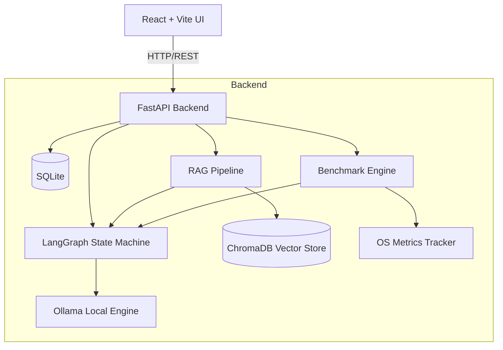
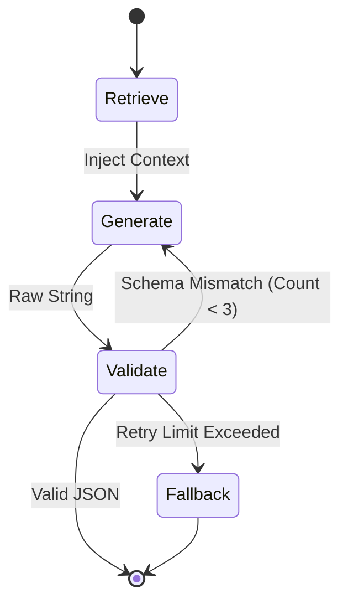

# System Architecture

## Overview
This offline AI Assistant is built using a modern, scalable microservice architecture. All inference runs locally.

## LangGraph Workflow
Our robust state machine ensures JSON integrity via cyclic retries.

